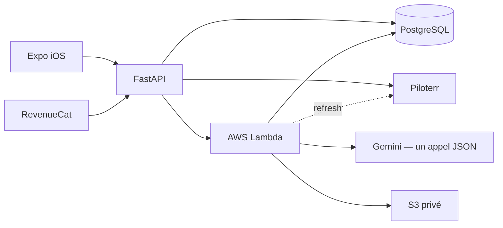

# DealUp

DealUp est une application iOS qui analyse une annonce Leboncoin d’iPhone ou de MacBook compatible avant achat : prix, risques, preuves manquantes et négociation.

La V1 cible l’acheteur occasionnel français. L’utilisateur crée un compte, partage ou colle une annonce, voit un teaser personnalisé, s’abonne, puis reçoit un rapport et l’action la plus utile à effectuer.

Le produit et les décisions business sont décrits dans [docs/product/product.md](docs/product/product.md).

## Décisions V1

- iOS et Leboncoin uniquement ;
- iPhone 11+, iPhone SE 2/3 et MacBook Air/Pro Apple Silicon M1+ ;
- compatibilité vérifiée avant paywall et quota ;
- Leboncoin comme seule source ;
- compte Clerk obligatoire ;
- connexion Apple, Google ou email ;
- partage Leboncoin vers DealUp via une extension iOS native ;
- hard paywall sans essai ni analyse complète gratuite ;
- Weekly à 4,99 € pour 15 annonces ;
- Monthly à 12,99 € pour 60 annonces ;
- top-up de 10 analyses à 4,99 € ;
- réanalyses vendeur incluses pour une annonce débloquée ;
- landing `joindealup.com` limitée à la présentation et au renvoi vers l’App Store.

## Architecture



Le dépôt garde quatre projets indépendants :

- `mobile/` — Expo, React Native, TypeScript et Expo Router ;
- `landing/` — Next.js et TypeScript ;
- `backend/` — FastAPI et PostgreSQL ;
- `workers/analysis-lambda/` — traitement Piloterr + Gemini.

Il n’y a ni package racine, ni dossier `apps/`, ni déploiement automatique.

Le backend embarque son catalogue public et le worker ses règles d’analyse. Ils ne dépendent d’aucun dossier de contrats partagé au déploiement. Git versionne le code ; les versions enregistrées en base servent uniquement à l’audit. Gemini reçoit un dossier naturel compact et renvoie un petit JSON, puis le worker calcule de façon déterministe le score, le verdict, le prix, l’action et le template public.

## Prérequis

- Node.js 22 et npm ;
- Python 3.12 ;
- Xcode pour le build iOS et l’extension de partage.
- Docker pour PostgreSQL local.

## Mobile

L’interface iOS utilise FastAPI, Clerk et RevenueCat réels. Les seules données synthétiques restantes sont les huit fixtures du laboratoire visuel, compilées uniquement dans les outils de développement. Le détail se trouve dans [`mobile/README.md`](mobile/README.md).

```bash
cd mobile
cp .env.example .env
npm install
npx expo run:ios
```

Vérifications :

```bash
npm run lint
npm run typecheck
```

## Landing

```bash
cd landing
cp .env.example .env.local
npm install
npm run dev
```

Vérifications :

```bash
npm run lint
npm run typecheck
npm run build
```

## Backend

```bash
# seulement si PostgreSQL local ne tourne pas déjà
docker compose up -d postgres
cd backend
python3 -m venv .venv
source .venv/bin/activate
pip install -r requirements-dev.txt
cp .env.example .env
alembic upgrade head
uvicorn app.main:app --reload
```

Migrations : `alembic upgrade head`  
Documentation API : `http://localhost:8000/docs`  
Tests : `pytest`

## Worker d’analyse

```bash
cd workers/analysis-lambda
python3 -m venv .venv
source .venv/bin/activate
pip install -r requirements-dev.txt
cp .env.example .env
pytest
```

Point d’entrée Lambda : `handler.handler`.

En local, laisser `ANALYSIS_INVOKE_MODE=disabled` dans FastAPI et lancer le worker réel en surveillance :

```bash
cd workers/analysis-lambda
source .venv/bin/activate
python run_local.py --watch
```

L’identification Piloterr est privée au parcours utilisateur. DealUp ne partage ni payload, ni résultat, ni cache d’annonce entre utilisateurs. Les photos analysées sont archivées dans S3 privé et supprimées avec l’analyse ou le compte.

## Intégrations

| Besoin | Service |
| --- | --- |
| Authentification | Clerk |
| Abonnements et top-up | RevenueCat |
| Analytics | PostHog |
| Erreurs | Sentry |
| Extraction Leboncoin | Piloterr |
| Analyse multimodale et recherche web | Gemini |

Les fichiers `.env.example` documentent les variables attendues. Aucun secret ne doit être ajouté au dépôt. La procédure complète Clerk, RevenueCat, PostgreSQL, S3, Lambda, PostHog, Sentry et EAS est dans [docs/operations/configuration.md](docs/operations/configuration.md).
