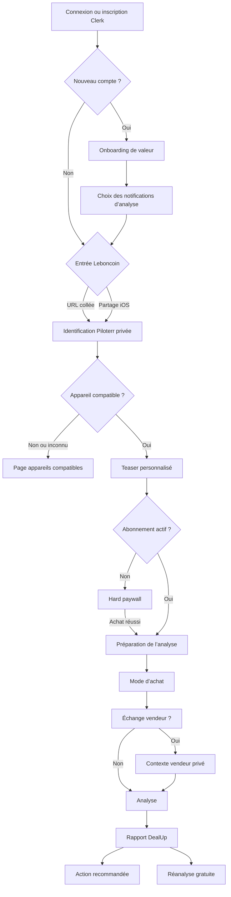
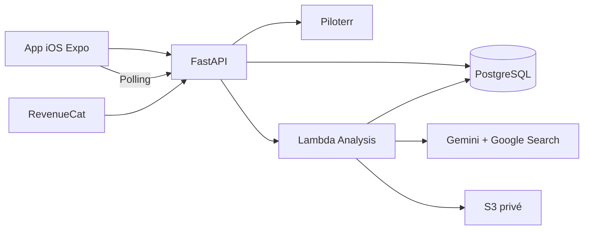

# DealUp — Produit V1 et Analyse V2

Version : 2.2
Date : 19 juillet 2026
Statut : source de vérité produit et technique

Ce document contient les décisions validées avec le fondateur. Les choix encore ouverts sont regroupés à la fin.

## 1. Produit

DealUp aide un acheteur occasionnel français à évaluer un appareil Apple d’occasion publié sur Leboncoin avant de payer.

La V1 répond à quatre questions :

1. cette annonce présente-t-elle un risque ?
2. quel est le juste niveau de prix ?
3. quelles preuves faut-il demander au vendeur ?
4. quelle est la prochaine action la plus utile ?

Promesse courte :

> Colle une annonce. DealUp analyse le prix, les photos, les preuves et les risques, puis prépare les questions et l’offre à envoyer.

DealUp est une aide à la décision, pas une certification. L’application ne garantit ni l’authenticité, ni l’absence de vol, ni le fonctionnement de l’appareil, ni le prix final accepté par le vendeur.

## 2. Périmètre V1

| Sujet | Décision |
| --- | --- |
| Plateforme | iOS uniquement |
| Marketplace | Leboncoin uniquement |
| iPhone | iPhone 11 et suivants, iPhone SE 2 et SE 3 |
| MacBook | MacBook Air et MacBook Pro avec puce Apple M1 ou plus récente |
| Non compatible | iPhone plus ancien, MacBook Intel, iPad, Apple Watch, Android et appareil non identifié |
| Compte | Clerk obligatoire avant de traiter un lien |
| Authentification | Apple, Google et email avec code |
| Accès | Hard paywall, sans essai gratuit ni analyse complète gratuite |
| Teaser | Identification privée Piloterr avant paiement |
| Paiement | RevenueCat et App Store |
| Rapport | Un écran scrollable avec navigation collante |
| IA | Un appel Gemini JSON avec Google Search |
| Acquisition | TikTok organique, géré par le fondateur |
| Landing | Présentation de l’app et redirection vers l’App Store |
| Objectif à six mois | Maximiser le cash-flow net |

La compatibilité est décidée avant le paywall et avant toute consommation de quota. Une annonce non compatible renvoie vers la page des appareils compatibles.

L’ajout futur d’une catégorie doit rester additif : profil produit, taxonomie, checklist, bloc de prompt, renderer mobile et fixtures contractuelles.

## 3. Parcours principal



Si une URL partagée arrive avant connexion, elle est conservée localement. Après authentification, le parcours reprend automatiquement sans demander de recoller le lien.

L’onboarding post-inscription comporte cinq écrans : démonstration statique des quatre étapes sur une vraie photo d’annonce de démonstration, comparaison animée prix affiché/offre avec une économie d’exemple clairement mise en avant, compression visuelle des recherches en un rapport DealUp, courbe de clarté grise « sans DealUp » face à la courbe verte « avec DealUp », puis demande contextuelle des notifications. Refuser ou reporter les notifications ne bloque jamais l’app.

L’écran de rapidité affiche « 39 annonces avant de choisir » et présente 39 comme le nombre moyen d’annonces d’occasion consultées avant l’achat d’un appareil tech. Cette donnée est une hypothèse marketing explicitement retenue par le fondateur et sa source externe reste à documenter avant publication. Le visuel ne prétend pas que DealUp réduit le nombre d’annonces consultées : il montre que l’application accélère l’évaluation de chacune en regroupant prix, photos, preuves, risques, verdict et action.

## 4. Identification et teaser

`POST /v1/listings/identify` appelle Piloterr, normalise l’annonce et renvoie :

```text
compatibility.status = SUPPORTED | UNSUPPORTED | UNKNOWN
device.category = IPHONE | MACBOOK
device.profile_code
device.display_name
device.specs
device.catalog_version
```

Le teaser peut afficher :

- modèle, configuration et stockage détectés ;
- prix demandé ;
- localisation et nombre de photos ;
- jusqu’à six photos de prévisualisation sélectionnées pour l’animation privée ;
- faits déjà présents dans l’annonce ;
- catégories que DealUp va analyser.

Il ne montre jamais gratuitement le score, le verdict, l’estimation, les risques détaillés ou les messages vendeur.

L’identification est privée à l’utilisateur. Elle peut servir au teaser, à l’animation d’inspection puis à sa première analyse afin de ne pas doubler l’appel Piloterr. Les URL de prévisualisation ne sont jamais partagées avec un autre utilisateur et ne deviennent jamais des preuves publiques.

La structure observée du fournisseur, les règles de normalisation et les champs à exclure sont maintenus dans [`piloterr-payload-reference.md`](piloterr-payload-reference.md).

## 5. Questions avant analyse

### Mode d’achat

> Comment comptes-tu acheter cet appareil ?

- remise en main propre ;
- livraison ;
- je ne sais pas encore.

Le libellé mobile peut préciser « cet iPhone » ou « ce MacBook ». Le choix adapte les risques, la checklist et les messages.

### Échange vendeur

> As-tu déjà échangé avec le vendeur ?

- non, pas encore ;
- oui, j’ai sa réponse.

Si oui, l’utilisateur peut ajouter le texte, des captures et de nouvelles photos. Ces données restent privées.

## 6. Monétisation

| Offre | Prix | Quota inclus |
| --- | ---: | ---: |
| Hebdomadaire (`weekly`) | 4,99 €/semaine | 15 nouvelles annonces par semaine |
| Mensuel (`monthly`) | 12,99 €/mois, soit 2,93 €/semaine | 60 nouvelles annonces par mois |
| Top-up | 4,99 € | 10 nouvelles analyses |

Décisions :

- aucun essai gratuit ;
- aucune première analyse complète gratuite ;
- aucune offre annuelle en V1 ;
- même niveau fonctionnel pour l’Hebdomadaire et le Mensuel ;
- le Mensuel porte le badge « Le plus populaire » dans le paywall ;
- le top-up est réservé aux abonnés actifs et n’expire pas ;
- le quota inclus est consommé avant le top-up.

Le prix hebdomadaire affiché pour le Mensuel est calculé dynamiquement avec `prix_mensuel / (31 / 7)`, puis arrondi au centime le plus proche : troisième décimale supérieure ou égale à 5 vers le haut, sinon vers le bas. Aucun symbole d’approximation n’est affiché.

Upsell à épuisement :

- Hebdomadaire : proposer le Mensuel puis le top-up ;
- Mensuel : proposer le top-up.

Produits RevenueCat prévus :

```text
premium
dealup_premium_weekly
dealup_premium_monthly
dealup_analysis_topup_10
```

RevenueCat est l’autorité de facturation. Le backend ne fait jamais confiance à un entitlement envoyé par le mobile.

### Consommation

- une nouvelle annonce consomme une unité ;
- revoir un rapport ne consomme rien ;
- une réanalyse avec réponse vendeur ne consomme rien ;
- un refresh explicite de l’annonce consomme une unité et rappelle Piloterr ;
- la même URL analysée par un autre utilisateur consomme sa propre unité ;
- un échec fournisseur recrédite exactement une fois le débit.

## 7. Coûts

Plan Piloterr connu : 49 € par mois pour 18 000 requêtes Leboncoin, soit environ 0,00272 € par extraction.

Le compte Google Cloud dispose de 2 000 USD de crédits Gemini. DealUp suit séparément le coût théorique et le coût facturé.

Pour chaque analyse :

- modèle, température et thinking level ;
- tokens d’entrée, de sortie et de réflexion ;
- nombre d’images et de recherches ;
- durée Piloterr, Gemini et totale ;
- coût Gemini théorique en micro-USD ;
- coût Piloterr en micro-euros ;
- version de la grille tarifaire fournisseur.

Le modèle Gemini exact reste choisi manuellement par le fondateur. Aucun corpus d’évaluation de 20 à 50 annonces ni fallback automatique vers un second modèle n’est imposé en V1.

## 8. Architecture et responsabilités



FastAPI gère l’authentification, la compatibilité, les quotas, les contrats publics et l’invocation asynchrone. La Lambda réserve le job, appelle Gemini, valide le candidat et produit le rapport final. PostgreSQL contient les données métier ; S3 contient les images privées.

L’invocation Lambda reste abstraite pour pouvoir passer à SQS plus tard sans changer l’API publique.

Les états sont exactement :

```text
pending
processing
completed
failed
```

## 9. Versionnement et propriété des règles

Git versionne l’implémentation. Il n’existe aucun fichier `prompt.v2.txt`, `taxonomy.v1.json` ou chargeur runtime dans un dossier racine `contracts/`.

- le backend possède localement son catalogue public et ses métadonnées d’audit dans `backend/app/domain/contracts.py` ;
- le worker possède localement ses taxonomies, pondérations et checklists dans `workers/analysis-lambda/analysis_worker/rules.py` ;
- le prompt et l’exemple JSON demandé à Gemini vivent directement dans l’intégration Gemini du worker.

La légère duplication est volontaire : FastAPI et la Lambda peuvent être construits et déployés séparément sans recopier un dossier racine oublié dans le zip.

Chaque nouvelle analyse capture une unique `engine_revision`, le modèle et sa configuration dans `run_metadata`. Une réanalyse conserve la révision de son parent ; un refresh prend la révision courante. Git reste la source de vérité détaillée. Un adaptateur conserve les anciens rapports `1.0` lisibles.

## 10. Entrée et sortie Gemini

Une analyse ou réanalyse effectue exactement un appel Gemini avec Google Search. L’entrée est un dossier naturel compact, pas un dump JSON de Piloterr :

```text
APPAREIL
Modèle détecté : iPhone 13
Configuration détectée : stockage 128 Go, couleur bleu

ANNONCE
Titre : iPhone 13 bleu 128 Go
Prix demandé : 180 €
Description du vendeur : Très bon état.
Caractéristiques déclarées : phone_memory = 128 Go
Nombre de photos jointes : 3

VENDEUR
Réputation vendeur : 3,4/5 sur 4 avis

CONTEXTE ACHETEUR
Mode d’achat prévu : livraison
```

Les champs vides sont omis. Le prompt n’inclut ni URL, identifiant technique, coordonnées, date d’indexation, compteur de favoris, boost ni logistique de livraison sans valeur analytique. La note Piloterr `rating_score`, observée entre 0 et 1, est normalisée sur 5 et accompagnée du nombre d’avis.

Les vraies images sont jointes séparément et référencées `PHOTO_1` à `PHOTO_10` puis `SELLER_MEDIA_1` à `SELLER_MEDIA_10`. Une réanalyse ajoute uniquement la conclusion et les codes utiles du rapport précédent ainsi que le nouveau contexte vendeur.

L’instruction système contient un exemple JSON brut. L’appel Gemini n’envoie aucun `response_format.schema`. La réponse compacte contient seulement :

```text
confidence
headline
summary
scores.price|condition|proofs|consistency|transaction
pricing
risks
positive_signals
missing_information
action_reason
messages.request_proofs|make_offer
changes
```

Le worker extrait le premier objet JSON même s’il est entouré de texte ou de balises Markdown. Il tronque les textes trop longs, borne les scores entre 0 et 100, limite les listes, supprime les références inconnues et transforme les codes de risque inconnus en `OTHER`. Une liste optionnelle absente devient vide. Une estimation incohérente rend uniquement le prix indisponible.

Seuls un JSON illisible, un titre/résumé absent ou le bloc des cinq sous-scores absent font échouer l’analyse. Gemini ne contrôle jamais le score final, le verdict final, l’ordre des sections, l’économie recalculée, les assets, les actions disponibles ou les libellés de checklist.

## 11. Taxonomies

Bloc commun : prix anormal, incohérence d’annonce, identité incertaine, preuve d’achat, historique vendeur limité, paiement hors plateforme, acompte, rencontre refusée, pression commerciale et communication incohérente.

Bloc iPhone : batterie, historique des pièces, Face ID, verrouillage d’activation, IMEI, stockage/couleur/modèle, verrouillage opérateur et variante régionale.

Bloc MacBook : cycles batterie, Activation Lock, MDM, puce/RAM/stockage, écran, clavier/trackpad, ports, chargeur, réparations et dommages liquides.

`OTHER` reste visible provisoirement :

- preuve et explication obligatoires ;
- sévérité maximale `MEDIUM` ;
- impact limité sur le score ;
- jamais action principale ;
- compté dans les métriques pour décider d’un futur code canonique.

Toute inférence sur la religion, l’origine, le genre ou une autre caractéristique sensible est rejetée. Une information absente est `UNVERIFIED`, jamais une accusation. Un écran d’activation ne prouve ni la propriété ni l’absence de verrouillage.

La lecture des photos suit également une hiérarchie de preuves stricte :

- un titre, une description et des attributs structurés concordants forment une identité fortement déclarée, mais pas une certification ;
- l’absence visuelle d’un bouton, port, capteur ou détail ne prouve jamais qu’il s’agit d’un autre modèle ;
- une variation de couleur peut venir de l’éclairage, des reflets ou de la balance des blancs et reste `UNVERIFIED`/`LOW` tant qu’aucune photo neutre ne la confirme ;
- une contradiction de modèle ne devient `HIGH` que si une preuve positive lisible montre un autre modèle, par exemple Réglages > Général > Informations, l’étiquette de la boîte ou un numéro de modèle ;
- le worker neutralise ces faux conflits visuels avant de calculer le rapport public, tout en conservant le candidat Gemini d’origine pour audit.

## 12. Score, prix et verdict

| Dimension | Poids |
| --- | ---: |
| Prix et valeur | 25 % |
| État visible ou déclaré | 20 % |
| Preuves et propriété | 25 % |
| Cohérence de l’annonce | 15 % |
| Sécurité de transaction | 15 % |

Le backend calcule le score pondéré et applique :

- risque critique confirmé : score maximal 29 et `PASS` ;
- preuve bloquante non résolue : score maximal 59 et `VERIFY_FIRST` ;
- deux risques `HIGH` non résolus : score maximal 64, jamais `BUY` ;
- score inférieur à 40 : `PASS` ;
- score 40–64 ou vérification bloquante : `VERIFY_FIRST` ;
- score 65–79 ou prix supérieur au prix juste : `NEGOTIATE` ;
- score au moins 80, aucun blocage et prix acceptable : `BUY`.

Cohérence des prix :

```text
market_low <= market_median <= market_high
market_low <= fair_price <= market_high
opening_offer <= agreement_low <= agreement_high <= max_recommended
potential_savings = max(prix demandé - milieu de la zone d’accord, 0)
```

Un JSON structurellement invalide fait échouer l’analyse et recrédite le quota. Si seule l’estimation est incohérente, le rapport reste disponible, le prix devient `UNAVAILABLE`, l’économie est masquée et le verdict est limité à `VERIFY_FIRST`.

## 13. Rapport mobile

Le rapport est un seul écran scrollable. Les composants sont communs et les templates déterminent uniquement l’ordre.

Le haut du rapport ne contient ni titre générique « Rapport DealUp », ni pastille `ACHETER` / `NÉGOCIER` / `VÉRIFIER` / `PASSER`, ni badge Leboncoin. Il commence par un en-tête compact avec retour, appareil/configuration, prix, lieu et nombre de photos. La première vraie photo de l’annonce peut y apparaître ; si elle manque, la mise en page reste textuelle sans illustration de remplacement. Le verdict est porté par la couleur de la jauge, le score, le titre personnalisé et l’ordre des sections.

La jauge conserve un éclat statique visible au point de progression. Cet effet reste décoratif et ne modifie jamais la lecture du score.

### BUY

1. verdict et score ;
2. raisons positives ;
3. prix et confirmation de valeur ;
4. action d’achat ;
5. checklist ;
6. risques résiduels.

### NEGOTIATE

1. verdict et score ;
2. économie potentielle ;
3. jauge de prix ;
4. offre recommandée et message ;
5. preuves et risques ;
6. checklist.

### VERIFY_FIRST

1. verdict et score plafonné ;
2. preuves manquantes ;
3. message vendeur ;
4. risques ;
5. prix conditionnel ;
6. checklist.

### PASS

1. verdict ;
2. risques critiques ;
3. explication personnalisée ;
4. action « Analyser une autre annonce ».

Le rapport gère prix indisponible, économie nulle, absence de risque confirmé, `OTHER`, faible confiance, éléments résolus et texte long. La révélation utilise haptique et animation adaptées au verdict, avec respect de « Réduire les animations ».

Pendant l’attente, l’app peut scanner visuellement la vraie vignette de l’annonce et les captures privées ajoutées par l’utilisateur. Le faisceau, les coins de détection et le changement d’image sont purement visuels : ils ne prétendent pas montrer l’ordre réel des calculs. L’icône DealUp reste statique et sans halo pulsant. Sans image exploitable, seules l’icône et les étapes restent visibles. Avec « Réduire les animations », le scan est figé.

Un laboratoire de développement masqué permet de prévisualiser les huit combinaisons : quatre verdicts × deux catégories. Ces fixtures ne remplacent jamais les services, comptes, achats, quotas ou historiques réels.

## 14. Données et confidentialité

`listing_identifications` conserve l’URL privée, l’identifiant Leboncoin, le payload Piloterr brut et normalisé, le teaser, la compatibilité et le profil appareil.

`users` conserve l’identifiant interne, l’identifiant Clerk, l’e-mail normalisé, le nom affiché facultatif, le fournisseur d’authentification et les dates de synchronisation. Le profil est récupéré via l’API Clerk après la première authentification puis rafraîchi au maximum une fois par jour ; aucun webhook Clerk n’est nécessaire en V1. Clerk reste la source de vérité et aucun mot de passe n’est stocké.

`usage_events` est le registre immuable des débits, crédits, top-ups et recrédits. Les soldes sont calculés depuis ce registre ; aucun compteur de crédits fragile n’est stocké dans `users`.

`analyses` conserve la parenté et l’état en colonnes, puis regroupe l’entrée immuable dans `input_snapshot`, le contexte vendeur dans `seller_context`, le candidat Gemini interne, le rapport public et les détails d’exécution dans `run_metadata`. Les métriques nécessaires au calcul du coût unitaire restent en colonnes interrogeables.

Les risques, prix, observations et textes restent en JSONB. Les métriques fréquemment interrogées ont leurs propres colonnes.

Les images analysées sont copiées dans S3 privé : maximum 10 photos d’annonce et 10 médias vendeur. Hash, MIME, taille, ordre et rôle restent en DB. Le mobile reçoit uniquement une URL signée courte après vérification d’appartenance.

Aucune purge temporelle automatique n’est activée pour l’instant. Les données restent jusqu’à suppression de l’analyse ou du compte. Cette politique est provisoire et doit être validée juridiquement. La suppression efface également les objets S3 via une tâche idempotente et retentable.

PostHog utilise toujours `users.id` comme identifiant distinct sur le mobile, l’API et le worker. L’e-mail, le fournisseur d’authentification et le forfait peuvent être définis comme propriétés de personne. Ne jamais envoyer d’URL complète, de nom vendeur, de conversation, de photo ou de payload Piloterr.

## 15. API publique

```text
GET    /health
GET    /ready
GET    /v1/catalog/compatible-devices
POST   /v1/listings/identify
POST   /v1/analyses
GET    /v1/analyses
GET    /v1/analyses/{id}
POST   /v1/analyses/{id}/reanalyze
POST   /v1/analyses/{id}/refresh
DELETE /v1/analyses/{id}
POST   /v1/devices
DELETE /v1/devices/{id}
GET    /v1/me
GET    /v1/me/usage
DELETE /v1/me
```

La liste renvoie des résumés légers, une URL signée courte pour la première vraie photo disponible et groupe la racine avec sa révision la plus récente. Supprimer une racine supprime toute sa chaîne et ses médias privés. La suppression du compte exige une confirmation explicite côté mobile puis anonymise le compte interne après suppression des données privées et du compte Clerk. Toutes les ressources authentifiées sont filtrées par l’utilisateur interne.

## 16. Marque, landing et assets

DealUp doit être rassurant, expert, énergique et complice. L’effet « casino » concerne le rythme de révélation et la récompense, jamais le prix, le renouvellement ou une fausse urgence.

Concept : une étiquette dont un coin se soulève pour révéler ce que l’annonce cache ou omet.

La landing `joindealup.com` présente l’app et renvoie vers l’App Store. Pas d’analyse web, de mini-rapport, de waitlist ou de parrainage en V1.

Elle publie également trois pages sobres requises pour l’exploitation de l’app : `/confidentialite`, `/conditions` et `/support`. Le support utilise uniquement `support@joindealup.com`, sans formulaire. Lors de la création d’un compte, l’écran d’authentification précise que l’inscription vaut acceptation des Conditions d’utilisation et de la Politique de confidentialité, avec des liens vers ces pages.

Assets existants : icône officielle DealUp, fond hero accueil, fond onboarding/authentification, vraies familles iPhone/MacBook utilisées sur la landing et la page de compatibilité, et photo Leboncoin dédiée à la démonstration onboarding.

Les écrans liés à une annonce — teaser, paywall, préparation, analyse, rapport et historique — utilisent uniquement les vraies photos de cette annonce ou les médias privés de l’utilisateur. Une image produit officielle ne doit jamais remplacer une preuve manquante ni laisser croire qu’elle appartient au vendeur. Si aucune vraie image n’est disponible, l’interface reste textuelle.

Il n’existe pas de banque d’images par modèle en V1 et aucun mockup générique iPhone/MacBook n’est affiché. Les deux visuels de famille déjà licenciés sont réservés à la page des appareils compatibles et à la landing. Un futur `asset_key` pourra brancher d’autres visuels officiels ou licenciés uniquement sur les surfaces non probatoires. Jauges, halos, glows et animations sont dessinés en code.

Les notifications de rapport terminé ou d’analyse échouée sont implémentées. Elles ne contiennent ni modèle, ni vendeur, ni URL, ni verdict sur l’écran verrouillé. Leur activation est facultative, disponible à la fin de l’onboarding et dans « Ton espace ». Un tap ouvre le rapport concerné. L’usage futur de notifications produit ou marketing reste à décider et ne doit pas faire l’objet d’une promesse dans l’interface.

## 17. Hors périmètre V1

- Android comme plateforme ou catégorie analysée ;
- iPad et Apple Watch ;
- MacBook Intel ;
- marketplaces autres que Leboncoin ;
- abonnement annuel ;
- parrainage ;
- analyse sur la landing ;
- envoi automatique au vendeur ;
- certification IMEI, anti-vol ou authenticité ;
- comparaison côte à côte ;
- chat IA généraliste ;
- second appel Gemini, second modèle ou fallback Pro automatique ;
- déploiement automatique.

## 18. Points encore ouverts

- identifiant exact du modèle Gemini de production ;
- tarifs Gemini exacts à renseigner dans la grille de coût ;
- nombre maximal de recherches web ;
- validation juridique de la conservation ;
- destination opérationnelle des échecs définitifs de suppression S3 ;
- identifiants finaux App Store Connect et RevenueCat ;
- résultats réels du pricing Hebdomadaire/Mensuel et des upsells ;
- intensité finale des animations, sons et haptiques ;
- validation sur appareils réels de Clerk, RevenueCat, PostHog, Sentry et Expo Push dans les environnements preview/production ;
- décision future d’ajouter iPad, Apple Watch ou Android.
