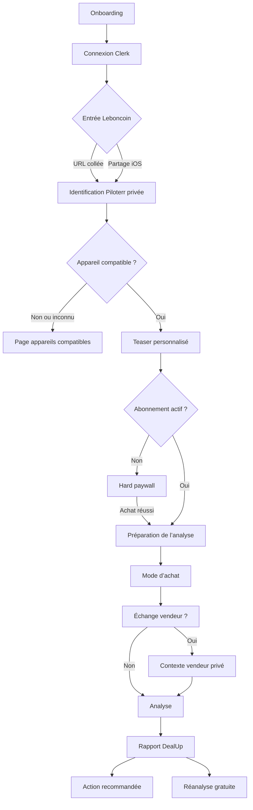
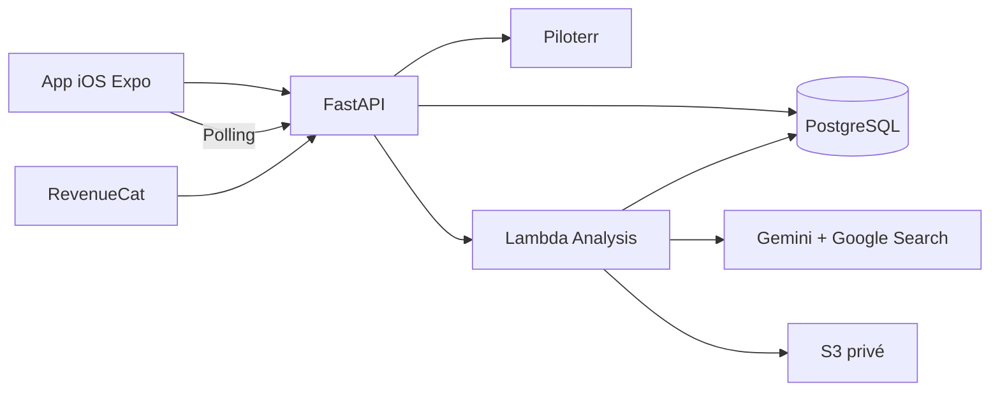

# DealUp — Produit V1 et Analyse V2

Version : 2.1  
Date : 16 juillet 2026  
Statut : source de vérité produit et technique

Ce document contient les décisions validées avec le fondateur. Les choix encore ouverts sont regroupés à la fin.

## 1. Produit

DealUp aide un acheteur occasionnel français à évaluer un appareil Apple d’occasion publié sur Leboncoin avant de payer.

La V1 répond à quatre questions :

1. cette annonce présente-t-elle un risque ?
2. quel est le juste niveau de prix ?
3. quelles preuves faut-il demander au vendeur ?
4. quelle est la prochaine action la plus utile ?

Promesse courte :

> Colle une annonce. DealUp analyse le prix, les photos, les preuves et les risques, puis prépare les questions et l’offre à envoyer.

DealUp est une aide à la décision, pas une certification. L’application ne garantit ni l’authenticité, ni l’absence de vol, ni le fonctionnement de l’appareil, ni le prix final accepté par le vendeur.

## 2. Périmètre V1

| Sujet | Décision |
| --- | --- |
| Plateforme | iOS uniquement |
| Marketplace | Leboncoin uniquement |
| iPhone | iPhone 11 et suivants, iPhone SE 2 et SE 3 |
| MacBook | MacBook Air et MacBook Pro avec puce Apple M1 ou plus récente |
| Non compatible | iPhone plus ancien, MacBook Intel, iPad, Apple Watch, Android et appareil non identifié |
| Compte | Clerk obligatoire avant de traiter un lien |
| Authentification | Apple, Google et email avec code |
| Accès | Hard paywall, sans essai gratuit ni analyse complète gratuite |
| Teaser | Identification privée Piloterr avant paiement |
| Paiement | RevenueCat et App Store |
| Rapport | Un écran scrollable avec navigation collante |
| IA | Un appel Gemini structuré avec Google Search |
| Acquisition | TikTok organique, géré par le fondateur |
| Landing | Présentation de l’app et redirection vers l’App Store |
| Objectif à six mois | Maximiser le cash-flow net |

La compatibilité est décidée avant le paywall et avant toute consommation de quota. Une annonce non compatible renvoie vers la page des appareils compatibles.

L’ajout futur d’une catégorie doit rester additif : profil produit, taxonomie, checklist, bloc de prompt, renderer mobile et fixtures contractuelles.

## 3. Parcours principal



Si une URL partagée arrive avant connexion, elle est conservée localement. Après authentification, le parcours reprend automatiquement sans demander de recoller le lien.

## 4. Identification et teaser

`POST /v1/listings/identify` appelle Piloterr, normalise l’annonce et renvoie :

```text
compatibility.status = SUPPORTED | UNSUPPORTED | UNKNOWN
device.category = IPHONE | MACBOOK
device.profile_code
device.display_name
device.specs
device.catalog_version
```

Le teaser peut afficher :

- modèle, configuration et stockage détectés ;
- prix demandé ;
- localisation et nombre de photos ;
- faits déjà présents dans l’annonce ;
- catégories que DealUp va analyser.

Il ne montre jamais gratuitement le score, le verdict, l’estimation, les risques détaillés ou les messages vendeur.

L’identification est privée à l’utilisateur. Elle peut servir au teaser puis à sa première analyse afin de ne pas doubler l’appel Piloterr. Elle n’est jamais réutilisée pour un autre utilisateur.

## 5. Questions avant analyse

### Mode d’achat

> Comment comptes-tu acheter cet appareil ?

- remise en main propre ;
- livraison ;
- je ne sais pas encore.

Le libellé mobile peut préciser « cet iPhone » ou « ce MacBook ». Le choix adapte les risques, la checklist et les messages.

### Échange vendeur

> As-tu déjà échangé avec le vendeur ?

- non, pas encore ;
- oui, j’ai sa réponse.

Si oui, l’utilisateur peut ajouter le texte, des captures et de nouvelles photos. Ces données restent privées.

## 6. Monétisation

| Offre | Prix | Quota inclus |
| --- | ---: | ---: |
| Weekly | 4,99 €/semaine | 15 nouvelles annonces par semaine |
| Monthly | 12,99 €/mois | 60 nouvelles annonces par mois |
| Top-up | 4,99 € | 10 nouvelles analyses |

Décisions :

- aucun essai gratuit ;
- aucune première analyse complète gratuite ;
- aucune offre annuelle en V1 ;
- même niveau fonctionnel pour Weekly et Monthly ;
- le top-up est réservé aux abonnés actifs et n’expire pas ;
- le quota inclus est consommé avant le top-up.

Upsell à épuisement :

- Weekly : proposer Monthly puis le top-up ;
- Monthly : proposer le top-up.

Produits RevenueCat prévus :

```text
premium
dealup_premium_weekly
dealup_premium_monthly
dealup_analysis_topup_10
```

RevenueCat est l’autorité de facturation. Le backend ne fait jamais confiance à un entitlement envoyé par le mobile.

### Consommation

- une nouvelle annonce consomme une unité ;
- revoir un rapport ne consomme rien ;
- une réanalyse avec réponse vendeur ne consomme rien ;
- un refresh explicite de l’annonce consomme une unité et rappelle Piloterr ;
- la même URL analysée par un autre utilisateur consomme sa propre unité ;
- un échec fournisseur recrédite exactement une fois le débit.

## 7. Coûts

Plan Piloterr connu : 49 € par mois pour 18 000 requêtes Leboncoin, soit environ 0,00272 € par extraction.

Le compte Google Cloud dispose de 2 000 USD de crédits Gemini. DealUp suit séparément le coût théorique et le coût facturé.

Pour chaque analyse :

- modèle, température et thinking level ;
- tokens d’entrée, de sortie et de réflexion ;
- nombre d’images et de recherches ;
- durée Piloterr, Gemini et totale ;
- coût Gemini théorique et facturé en micro-USD ;
- coût Piloterr en micro-euros ;
- version de la grille tarifaire fournisseur.

Le modèle Gemini exact reste choisi manuellement par le fondateur. Aucun corpus d’évaluation de 20 à 50 annonces ni fallback automatique vers un second modèle n’est imposé en V1.

## 8. Architecture et responsabilités



FastAPI gère l’authentification, la compatibilité, les quotas, les contrats publics et l’invocation asynchrone. La Lambda réserve le job, appelle Gemini, valide le candidat et produit le rapport final. PostgreSQL contient les données métier ; S3 contient les images privées.

L’invocation Lambda reste abstraite pour pouvoir passer à SQS plus tard sans changer l’API publique.

Les états sont exactement :

```text
pending
processing
completed
failed
```

## 9. Contrats versionnés

La source de vérité technique est `contracts/analysis/`, composée uniquement de JSON et TXT versionnés.

```text
schema_version=2.0
prompt_version=2.0
taxonomy_version=1.0
scoring_version=1.0
checklist_version=1.0
device_catalog_version=1.0
```

Chaque analyse capture toutes ces versions ainsi que le modèle et sa configuration. Une réanalyse conserve les versions du parent afin que seuls les nouveaux éléments vendeur expliquent les changements. Un refresh payant utilise les versions actives.

Un adaptateur de lecture conserve les anciens rapports `1.0` lisibles pendant la transition.

## 10. Contrat Gemini V2

Une analyse ou réanalyse effectue exactement un appel Gemini. Gemini reçoit :

- annonce Piloterr normalisée ;
- jusqu’à 10 photos de l’annonce ;
- mode d’achat ;
- contexte et jusqu’à 10 médias vendeur si présents ;
- rapport parent lors d’une réanalyse ;
- taxonomie commune et taxonomie de la catégorie ;
- checklist autorisée ;
- règles de sortie structurée ;
- Google Search.

Gemini retourne un `GeminiCandidateV2` interne, jamais exposé au mobile : identité, cinq sous-scores argumentés, prix candidat, observations, risques, signaux positifs, informations manquantes, codes checklist, messages et textes personnalisés.

Chaque risque contient :

```text
code
status = CONFIRMED | LIKELY | UNVERIFIED | RESOLVED
severity = LOW | MEDIUM | HIGH | CRITICAL
evidence_refs[]
generated_content.display_title
generated_content.commentary
generated_content.recommended_check
```

Sources d’évidence autorisées :

```text
LISTING_ATTRIBUTE
LISTING_TEXT
LISTING_PHOTO
SELLER_MESSAGE
SELLER_MEDIA
WEB_MARKET
PRIOR_ANALYSIS
```

Gemini garde une liberté éditoriale encadrée : titre du verdict, résumé, titres et commentaires de risque, vérifications, commentaire de prix, note experte et messages vendeur. Ces textes rendent l’analyse spécifique à l’annonce.

Gemini ne contrôle jamais les codes métier, le score final, le verdict final, l’ordre des sections, les montants recalculés, les assets ou les libellés exacts de checklist.

## 11. Taxonomies

Bloc commun : prix anormal, incohérence d’annonce, identité incertaine, preuve d’achat, historique vendeur limité, paiement hors plateforme, acompte, rencontre refusée, pression commerciale et communication incohérente.

Bloc iPhone : batterie, historique des pièces, Face ID, verrouillage d’activation, IMEI, stockage/couleur/modèle, verrouillage opérateur et variante régionale.

Bloc MacBook : cycles batterie, Activation Lock, MDM, puce/RAM/stockage, écran, clavier/trackpad, ports, chargeur, réparations et dommages liquides.

`OTHER` reste visible provisoirement :

- preuve et explication obligatoires ;
- sévérité maximale `MEDIUM` ;
- impact limité sur le score ;
- jamais action principale ;
- compté dans les métriques pour décider d’un futur code canonique.

Toute inférence sur la religion, l’origine, le genre ou une autre caractéristique sensible est rejetée. Une information absente est `UNVERIFIED`, jamais une accusation. Un écran d’activation ne prouve ni la propriété ni l’absence de verrouillage.

## 12. Score, prix et verdict

| Dimension | Poids |
| --- | ---: |
| Prix et valeur | 25 % |
| État visible ou déclaré | 20 % |
| Preuves et propriété | 25 % |
| Cohérence de l’annonce | 15 % |
| Sécurité de transaction | 15 % |

Le backend calcule le score pondéré et applique :

- risque critique confirmé : score maximal 29 et `PASS` ;
- preuve bloquante non résolue : score maximal 59 et `VERIFY_FIRST` ;
- deux risques `HIGH` non résolus : score maximal 64, jamais `BUY` ;
- score inférieur à 40 : `PASS` ;
- score 40–64 ou vérification bloquante : `VERIFY_FIRST` ;
- score 65–79 ou prix supérieur au prix juste : `NEGOTIATE` ;
- score au moins 80, aucun blocage et prix acceptable : `BUY`.

Cohérence des prix :

```text
market_low <= market_median <= market_high
market_low <= fair_price <= market_high
opening_offer <= agreement_low <= agreement_high <= max_recommended
potential_savings = max(prix demandé - milieu de la zone d’accord, 0)
```

Un JSON structurellement invalide fait échouer l’analyse et recrédite le quota. Si seule l’estimation est incohérente, le rapport reste disponible, le prix devient `UNAVAILABLE`, l’économie est masquée et le verdict est limité à `VERIFY_FIRST`.

## 13. Rapport mobile

Le rapport est un seul écran scrollable. Les composants sont communs et les templates déterminent uniquement l’ordre.

### BUY

1. verdict et score ;
2. raisons positives ;
3. prix et confirmation de valeur ;
4. action d’achat ;
5. checklist ;
6. risques résiduels.

### NEGOTIATE

1. verdict et score ;
2. économie potentielle ;
3. jauge de prix ;
4. offre recommandée et message ;
5. preuves et risques ;
6. checklist.

### VERIFY_FIRST

1. verdict et score plafonné ;
2. preuves manquantes ;
3. message vendeur ;
4. risques ;
5. prix conditionnel ;
6. checklist.

### PASS

1. verdict ;
2. risques critiques ;
3. explication personnalisée ;
4. action « Analyser une autre annonce ».

Le rapport gère prix indisponible, économie nulle, absence de risque confirmé, `OTHER`, faible confiance, éléments résolus et texte long. La révélation utilise haptique et animation adaptées au verdict, avec respect de « Réduire les animations ».

Un laboratoire mock masqué permet de prévisualiser les huit combinaisons : quatre verdicts × deux catégories.

## 14. Données et confidentialité

`listing_identifications` conserve l’URL privée, l’identifiant Leboncoin, le payload Piloterr brut et normalisé, le teaser, la compatibilité et le profil appareil.

`analyses` conserve l’entrée, la parenté, le candidat Gemini interne, le rapport public, le template, les versions, le modèle, la configuration, l’empreinte d’entrée, les sources web internes et les métriques de coût.

Les risques, prix, observations et textes restent en JSONB. Les métriques fréquemment interrogées ont leurs propres colonnes.

Les images analysées sont copiées dans S3 privé : maximum 10 photos d’annonce et 10 médias vendeur. Hash, MIME, taille, ordre et rôle restent en DB. Le mobile reçoit uniquement une URL signée courte après vérification d’appartenance.

Aucune purge temporelle automatique n’est activée pour l’instant. Les données restent jusqu’à suppression de l’analyse ou du compte. Cette politique est provisoire et doit être validée juridiquement. La suppression efface également les objets S3 via une tâche idempotente et retentable.

Ne jamais envoyer à PostHog d’URL complète, de nom vendeur, de conversation ou de photo. Les sources Gemini, métriques fournisseur et payloads bruts ne sont jamais exposés au mobile.

## 15. API publique

```text
GET    /health
GET    /ready
GET    /v1/catalog/compatible-devices
POST   /v1/listings/identify
POST   /v1/analyses
GET    /v1/analyses
GET    /v1/analyses/{id}
POST   /v1/analyses/{id}/reanalyze
POST   /v1/analyses/{id}/refresh
DELETE /v1/analyses/{id}
```

La liste renvoie des résumés légers et groupe la racine avec sa révision la plus récente. Supprimer une racine supprime toute sa chaîne et ses médias privés. Toutes les ressources authentifiées sont filtrées par l’utilisateur interne.

## 16. Marque, landing et assets

DealUp doit être rassurant, expert, énergique et complice. L’effet « casino » concerne le rythme de révélation et la récompense, jamais le prix, le renouvellement ou une fausse urgence.

Concept : une étiquette dont un coin se soulève pour révéler ce que l’annonce cache ou omet.

La landing `joindealup.com` présente l’app et renvoie vers l’App Store. Pas d’analyse web, de mini-rapport, de waitlist ou de parrainage en V1.

Assets existants : icône officielle DealUp, fond hero accueil et fond onboarding/authentification.

Assets optionnels à fournir plus tard :

```text
iphone-family-placeholder.webp
1200 × 1200 px, transparent, carré, moins de 250 Ko

macbook-family-placeholder.webp
1600 × 1200 px, transparent, cadrage horizontal sûr, moins de 300 Ko
```

Les rapports utilisent d’abord les vraies photos. Il n’existe pas de banque d’images par modèle en V1 ; un `asset_key` facultatif permet d’ajouter plus tard un CDN licencié. Jauges, halos, glows et animations sont dessinés en code.

## 17. Hors périmètre V1

- Android comme plateforme ou catégorie analysée ;
- iPad et Apple Watch ;
- MacBook Intel ;
- marketplaces autres que Leboncoin ;
- abonnement annuel ;
- parrainage ;
- analyse sur la landing ;
- envoi automatique au vendeur ;
- certification IMEI, anti-vol ou authenticité ;
- comparaison côte à côte ;
- chat IA généraliste ;
- second appel Gemini, second modèle ou fallback Pro automatique ;
- déploiement automatique.

## 18. Points encore ouverts

- identifiant exact du modèle Gemini de production ;
- tarifs Gemini exacts à renseigner dans la grille de coût ;
- nombre maximal de recherches web ;
- validation juridique de la conservation ;
- destination opérationnelle des échecs définitifs de suppression S3 ;
- identifiants finaux App Store Connect et RevenueCat ;
- résultats réels du pricing Weekly/Monthly et des upsells ;
- visuels de familles iPhone et MacBook ;
- intensité finale des animations, sons et haptiques ;
- branchement réel Clerk, RevenueCat, PostHog, Sentry et notification push ;
- décision future d’ajouter iPad, Apple Watch ou Android.
