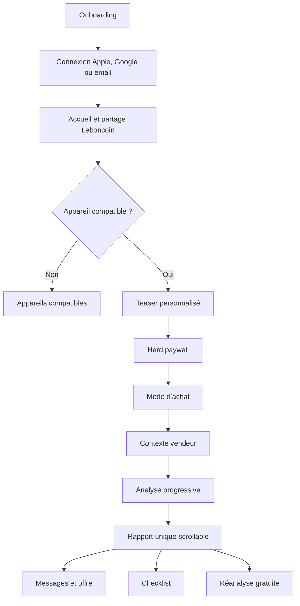

# DealUp Mobile

Application iOS Expo, React Native et TypeScript. L’interface V1 couvre le parcours d’un acheteur d’iPhone 11+/SE 2/3 ou de MacBook Air/Pro M1+, de l’onboarding au rapport et à la réanalyse vendeur.

## Démarrage de l’interface

```bash
cp .env.example .env
npm install --include=dev
npm start
```

`EXPO_PUBLIC_USE_MOCKS=true` est la valeur par défaut. Dans ce mode :

- aucune requête n’est envoyée à FastAPI ;
- la connexion Clerk est simulée ;
- les achats RevenueCat/App Store sont simulés ;
- une annonce Leboncoin et un rapport réalistes sont disponibles ;
- les choix, le quota et la checklist sont persistés localement.

Depuis l’accueil, toucher « Utiliser l’annonce de démonstration » permet de tester tout le tunnel sans presse-papiers.

## Parcours implémentés



Écrans secondaires inclus : historique, profil, restauration d’achat, quota épuisé, passage au Monthly et top-up de 10 analyses.

Depuis le profil en mode mock :

- « Appareils compatibles » ouvre le catalogue avec fallback local versionné ;
- « Laboratoire des rapports » ouvre les huit fixtures `4 verdicts × 2 catégories` ;
- « Prévisualiser l’analyse » montre l’animation sans fournisseur payant.

## Vérifications locales

```bash
npm run lint
npm run typecheck
npx expo export --platform ios
```

L’extension de partage iOS est générée par le plugin officiel `expo-sharing`. Elle accepte un texte ou une URL web et redirige vers `handle-share`. Elle nécessite un build natif :

```bash
npx expo run:ios
```

Le bundle principal prévu est `com.joindealup.app`, l’extension `com.joindealup.app.ShareExtension` et l’App Group `group.com.joindealup.app`. Ces identifiants devront être confirmés avant App Store Connect.

## Organisation

```text
src/
  app/          routes Expo Router
  components/   composants UI réutilisables
  data/         données de démonstration
  services/     API et télémétrie, sans état UI
  store/        état de parcours et persistance locale
  theme/        couleurs, typographie, espacements et élévations
  types/        contrats TypeScript partagés côté mobile
  utils/        fonctions pures
```

Le contrat HTTP V2 est isolé dans `src/services/dealup-api.ts`. Passer `EXPO_PUBLIC_USE_MOCKS=false` active ce chemin, mais l’authentification Bearer Clerk et les achats réels restent à brancher avant un test de bout en bout.

## Intégrations restant à brancher

- Clerk : remplacer `signInDemo` par les flux Apple, Google et code email ;
- RevenueCat : remplacer les achats simulés par les produits `dealup_premium_weekly`, `dealup_premium_monthly` et `dealup_analysis_topup_10` ;
- PostHog : envoyer les événements de `src/services/telemetry.ts` ;
- Sentry : initialiser le SDK avec `EXPO_PUBLIC_SENTRY_DSN` ;
- FastAPI : fournir le token Clerk et valider les mappers JSON en environnement de développement.

Les emplacements et spécifications des visuels à fournir sont décrits dans [assets/README.md](assets/README.md).
